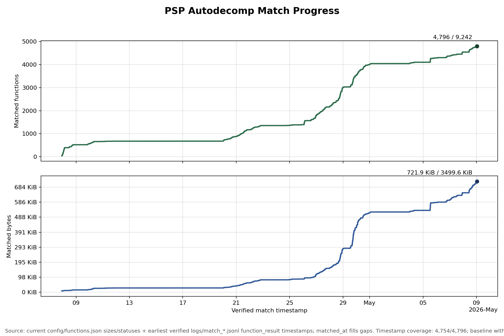

# Match Progress Chart

Latest tracked snapshot:



- PNG: `docs/research/match-progress-20260509.png`
- CSV: `docs/research/match-progress-20260509.csv`
- Current final point: 4,796 / 9,242 functions and 739,276 / 3,583,564 bytes.
- Timestamp coverage: 4,754 / 4,796 matched rows. Of those, 4,751 came from
  `logs/match_*.jsonl`; 42 currently matched rows had no usable timestamp and
  were placed in the first baseline bucket.

## Methodology

The chart is generated by `tools/research/match_progress_chart.py`.

The script treats the current `config/functions.json` as the source of truth
for which functions are currently matched and how many bytes each function is
worth. It then scans `logs/match_*.jsonl` for `function_result` events with
`status == "matched"` and uses the earliest such timestamp for each currently
matched address. If a current DB row has `matched_at`, that fills gaps when it
is earlier than or absent from the log-derived timestamp. Any currently matched
row with no timestamp in either source is placed into the first baseline
bucket.

This means the chart answers: "for the functions that are matched now, when did
we first record them as matched?" It is intentionally not a full historical
state machine. If a function matched, regressed, and later matched again, the
current script plots the earliest recorded match for that currently matched
address.

## Regeneration

For a scratch chart:

```sh
python3 tools/research/match_progress_chart.py
```

That writes:

- `build/research/match_progress.png`
- `build/research/match_progress.csv`

For a tracked docs snapshot, use a dated filename:

```sh
python3 tools/research/match_progress_chart.py --output docs/research/match-progress-YYYYMMDD.png --csv docs/research/match-progress-YYYYMMDD.csv
```

Then update the latest snapshot links and counts in this file.
